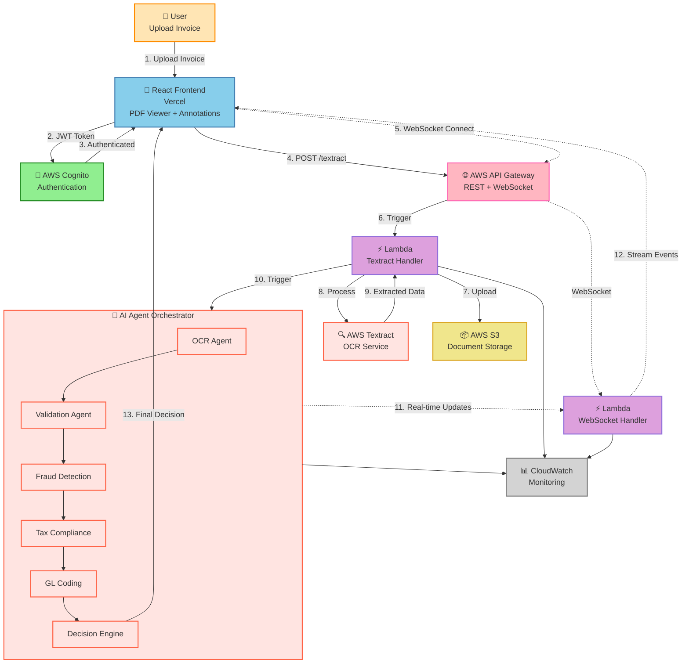

# Invoisaic Architecture Diagram

## Mermaid Diagram Code (Paste in Mermaid Live Editor or GitHub)



---

## ASCII Architecture Diagram

```
                    ┌─────────────────────┐
                    │   👤 User           │
                    │   Upload Invoice    │
                    └──────────┬──────────┘
                               │
                               ▼
                    ┌─────────────────────┐
                    │  🔐 AWS Cognito     │
                    │  Authentication     │
                    └──────────┬──────────┘
                               │ JWT Token
                               ▼
    ┌──────────────────────────────────────────────────────┐
    │         🎨 React Frontend (Vercel)                   │
    │  • PDF Viewer with Live Annotations                  │
    │  • Agent Activity Stream                             │
    │  • WebSocket Connection                              │
    └────────┬─────────────────────────────┬───────────────┘
             │ POST /textract              │ WebSocket
             ▼                             ▼
    ┌─────────────────────────────────────────────────────┐
    │       🌐 AWS API Gateway                            │
    │       REST API + WebSocket API                      │
    └────────┬─────────────────────────────┬──────────────┘
             │                             │
             ▼                             ▼
    ┌────────────────┐            ┌────────────────┐
    │ ⚡ Lambda       │            │ ⚡ Lambda       │
    │ Textract       │            │ WebSocket      │
    │ Handler        │            │ Handler        │
    └────┬───────┬───┘            └────────────────┘
         │       │                         ▲
         │       │                         │ Real-time
         │       ▼                         │ Updates
         │  ┌─────────────┐               │
         │  │ 🔍 AWS      │               │
         │  │ Textract    │               │
         │  │ OCR         │               │
         │  └─────────────┘               │
         │                                 │
         ▼                                 │
    ┌─────────────┐                       │
    │ 📦 AWS S3   │                       │
    │ Documents   │                       │
    └─────────────┘                       │
         │                                 │
         ▼                                 │
    ┌────────────────────────────────────────────────────┐
    │     🤖 AI Agent Orchestrator                       │
    │                                                    │
    │  ┌──────────┐  ┌──────────┐  ┌──────────┐       │
    │  │   OCR    │→ │Validation│→ │  Fraud   │       │
    │  │  Agent   │  │  Agent   │  │ Detection│       │
    │  └──────────┘  └──────────┘  └──────────┘       │
    │                                      ↓            │
    │  ┌──────────┐  ┌──────────┐  ┌──────────┐       │
    │  │ Decision │← │    GL    │← │   Tax    │       │
    │  │  Engine  │  │  Coding  │  │Compliance│       │
    │  └──────────┘  └──────────┘  └──────────┘       │
    │                                                    │
    └────────────────────────┬───────────────────────────┘
                             │
                             ▼
                    ┌─────────────────┐
                    │ 📊 CloudWatch   │
                    │ Monitoring      │
                    └─────────────────┘

═══════════════════════════════════════════════════════════
                    DATA FLOW
═══════════════════════════════════════════════════════════

1. User uploads invoice → React Frontend
2. Frontend authenticates → AWS Cognito
3. File sent to API Gateway → POST /textract
4. WebSocket connection established
5. Lambda uploads file → S3
6. Lambda calls AWS Textract → OCR extraction
7. Textract returns structured data
8. AI Orchestrator triggers 6 agents in parallel:
   • OCR Agent: Extract fields with bounding boxes
   • Validation Agent: Check data quality
   • Fraud Agent: Analyze risk patterns
   • Tax Agent: Verify compliance
   • GL Agent: Suggest account codes
   • Decision Engine: APPROVED/REJECTED
9. Each agent sends real-time updates → WebSocket
10. Frontend receives events:
    • field_extracted → Live PDF annotations
    • agent_activity → Activity stream updates
    • processing_complete → Final decision
11. All logs → CloudWatch for monitoring

═══════════════════════════════════════════════════════════
                  WEBSOCKET EVENTS
═══════════════════════════════════════════════════════════

Frontend ←─── processing_started ───── AI Orchestrator
Frontend ←─── field_extracted ──────── OCR Agent
Frontend ←─── agent_activity ───────── All Agents
Frontend ←─── fraud_analysis ──────── Fraud Agent
Frontend ←─── tax_analysis ─────────── Tax Agent
Frontend ←─── gl_entries ───────────── GL Agent
Frontend ←─── processing_complete ──── Decision Engine

═══════════════════════════════════════════════════════════
```

---

## Simplified Flow Diagram

```
┌──────┐     ┌─────────┐     ┌────────┐     ┌────────┐
│ User │ ──→ │ Vercel  │ ──→ │  API   │ ──→ │ Lambda │
│      │     │ React   │     │Gateway │     │Textract│
└──────┘     └────┬────┘     └────────┘     └───┬────┘
                  │                               │
                  │ WebSocket                     ▼
                  │ (Real-time)           ┌──────────────┐
                  │                       │ AWS Textract │
                  │                       │     OCR      │
                  │                       └──────┬───────┘
                  │                              │
                  │                              ▼
                  │                       ┌──────────────┐
                  │                       │  AI Agents   │
                  │                       │  (6 agents)  │
                  │                       └──────┬───────┘
                  │                              │
                  └──────────────────────────────┘
                         Live Updates
                    (Annotations, Status,
                     Decision, Analytics)
```

---

## Component Breakdown

### 🎨 **Frontend (Vercel)**
- React 18 + TypeScript + Vite
- TailwindCSS + shadcn/ui
- PDF.js for rendering
- WebSocket client
- Framer Motion animations

### 🌐 **API Layer**
- AWS API Gateway (REST)
  - POST /textract
  - GET /invoices
- AWS API Gateway (WebSocket)
  - Real-time bidirectional communication

### ⚡ **Compute Layer**
- AWS Lambda (Node.js/TypeScript)
  - Textract Handler
  - WebSocket Handler
  - AI Orchestrator

### 🤖 **AI Agent Pipeline**
1. **OCR Agent** → AWS Textract
2. **Validation Agent** → Data quality
3. **Fraud Agent** → Risk analysis
4. **Tax Agent** → Compliance check
5. **GL Agent** → Account coding
6. **Decision Engine** → Final verdict

### 📦 **Storage Layer**
- AWS S3 (documents)
- AWS Cognito (users)

### 📊 **Monitoring**
- AWS CloudWatch (logs + metrics)

---

## Technology Stack Summary

```
┌─────────────────────────────────────────────────────┐
│                   FRONTEND                          │
│  React • TypeScript • Vite • TailwindCSS            │
│  shadcn/ui • Framer Motion • PDF.js                 │
└─────────────────────────────────────────────────────┘
                        ↕
┌─────────────────────────────────────────────────────┐
│                   API LAYER                         │
│  AWS API Gateway (REST + WebSocket)                 │
└─────────────────────────────────────────────────────┘
                        ↕
┌─────────────────────────────────────────────────────┐
│                  COMPUTE LAYER                      │
│  AWS Lambda (Node.js + TypeScript)                  │
└─────────────────────────────────────────────────────┘
                        ↕
┌─────────────────────────────────────────────────────┐
│                   AI SERVICES                       │
│  AWS Textract • Custom AI Agents                    │
└─────────────────────────────────────────────────────┘
                        ↕
┌─────────────────────────────────────────────────────┐
│                  STORAGE LAYER                      │
│  AWS S3 • AWS Cognito                               │
└─────────────────────────────────────────────────────┘
```

---

## How to Use These Diagrams

### **Mermaid Diagram:**
1. Copy the Mermaid code above
2. Go to https://mermaid.live
3. Paste the code
4. Export as PNG/SVG

### **ASCII Diagrams:**
- Use directly in README.md
- Copy to documentation
- Include in presentations

### **For Presentations:**
- Use Mermaid for professional slides
- Use ASCII for technical documentation
- Reference this file in your README
